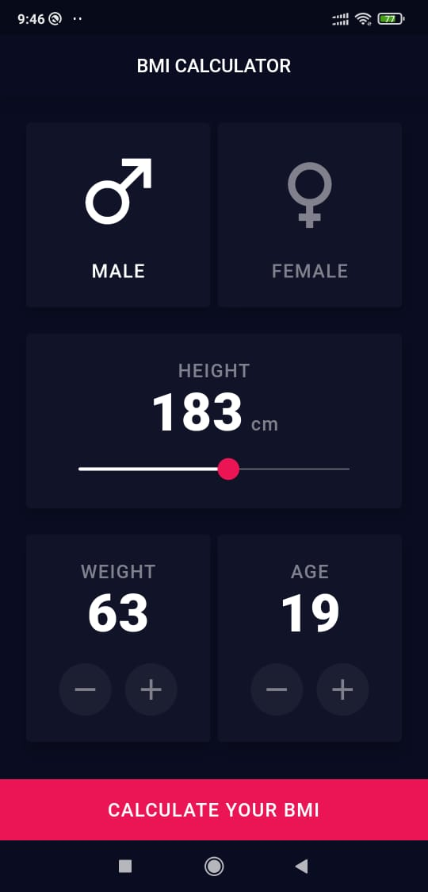
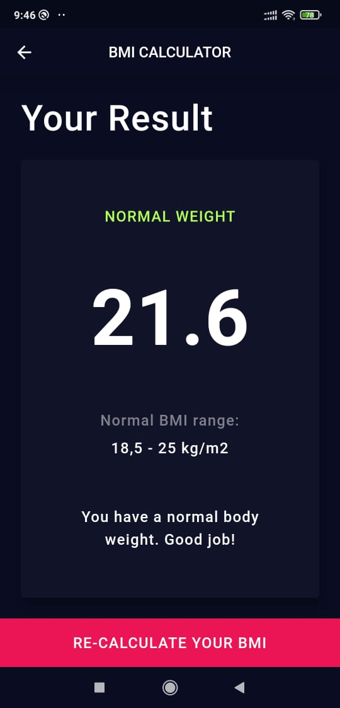
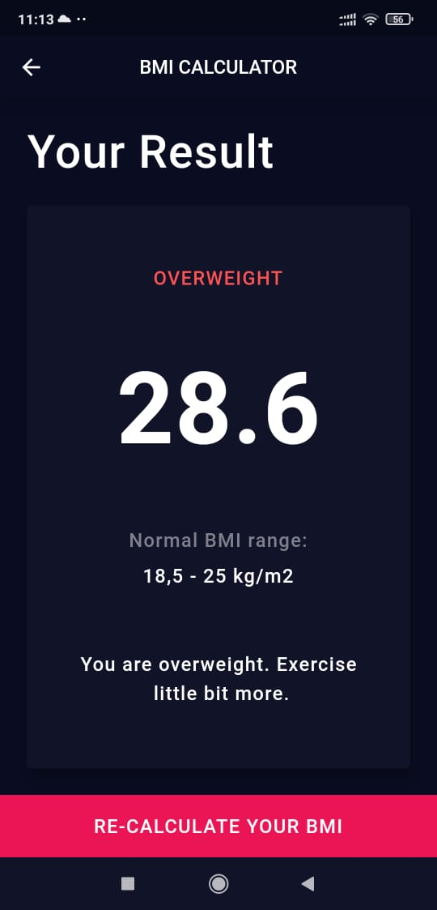
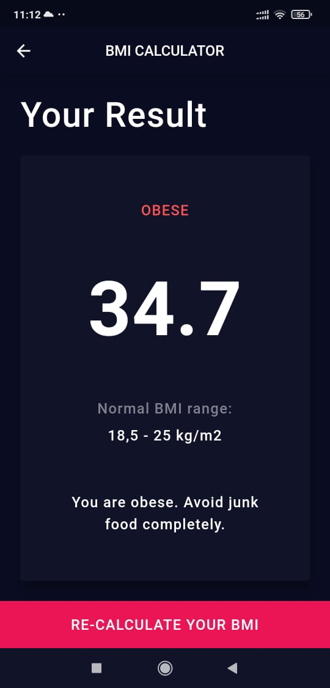

# BMI Calculator 💪🖩
> BMI calculator is a Flutter application to calculate BMI (Body Mass Index).

> This application is inspired by and attempt to recreate design made by [Ruben Vaalt on Dribbble](https://dribbble.com/shots/4585382-Simple-BMI-Calculator). 

## Technology Used

 - [Flutter](https://flutter.dev/)
 - [Dart](https://dart.dev/)

## Getting started

 1. Download the code.
 2. Open the code in [Android Studio](https://developer.android.com/studio) or [Visual Studio Code](https://code.visualstudio.com/)
 3. Set up Dart and Flutter
 4. Run the app. 😊

## Screenshots
 

 

## Getting Started Resources
This project is a starting point for a Flutter application.

A few resources to get you started if this is your first Flutter project:

- [Lab: Write your first Flutter app](https://flutter.dev/docs/get-started/codelab)
- [Cookbook: Useful Flutter samples](https://flutter.dev/docs/cookbook)

For help getting started with Flutter, view our
[online documentation](https://flutter.dev/docs), which offers tutorials,
samples, guidance on mobile development, and a full API reference.
